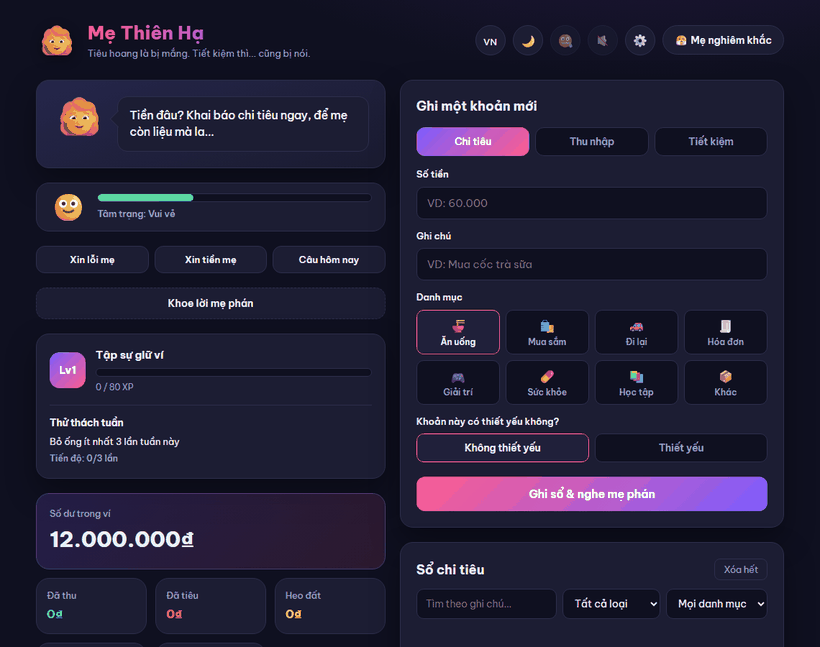

# Money Mom 👩‍🦰💸

**🌐 Language:** [Tiếng Việt](README.md) · English

> A budgeting app that **scolds you until you finally start saving**.

[](https://tridpt.github.io/money-mom/)
[](https://tridpt.github.io/money-mom/)
[](https://tridpt.github.io/money-mom/)
[](LICENSE)


**🔗 Try it now (no install needed): [tridpt.github.io/money-mom](https://tridpt.github.io/money-mom/)**



Instead of dull income/expense charts, Money Mom manages your wallet by... **nagging and roasting you**. Log a non-essential expense and it fires back instantly: *"You earn peanuts but spend like a CEO, huh?"*. Drop something in the piggy bank and it praises you sarcastically: *"Oh, thinking about your future now, are we?"*.

> Bilingual 🇻🇳 / 🇬🇧 · Works offline (PWA) · All data stays entirely on your device.

## ✨ Features

**Core**
- 🛍️ Log expenses / income / savings, sorted into 8 categories.
- 😤 Mom scolds you when you overspend, praises you (sarcastically) when you save.
- 📒 Spending log (search, filter, edit, delete) + balance tracking.
- 💾 Stored locally (localStorage) — no server, no login.

**Fun & addictive**
- 💔 5 characters: Strict Mom, Pragmatic Ex, Stingy Boss, Nosy Neighbor, Cold Dad.
- ✍️ Write your own scolding lines & 🎭 create your own characters.
- 💥 Escalating overspending combos · 🔥 saving streaks · 🏆 achievement badges · ⭐ level/XP system.
- 🔊 Reaction sound effects · 🗣️ text-to-speech reads the scolds out loud · 🎉 confetti.
- 📸 Turn your "getting scolded" moments into shareable images for Facebook / X / Threads.

**Finance tools**
- 🎯 Monthly budget (total & per-category) + over-budget warnings.
- 🏁 Savings goals with progress bars.
- 🔁 Recurring expenses with monthly reminders.
- 🥧📊📈 Pie / bar / month-over-month charts + savings rate.
- 📅 Automatic monthly summary · 🔮 end-of-month prediction · 📝 daily reminders.
- 💱 Real currency switching (VND, USD, EUR, JPY, KRW, GBP).

**Experience**
- 📲 PWA: install to your home screen, run offline.
- 🌗 Light/dark mode · 🌐 bilingual VI/EN · 👋 onboarding · ✨ optional AI mode.
- 💾 Export / import JSON data for backup and device migration.

## 🚀 Running locally

No build step required:

```bash
# Option 1: open index.html directly in your browser

# Option 2 (recommended, so PWA/service worker works):
npx http-server . -p 8080 -c-1
# then open http://127.0.0.1:8080
```

**Option 3 (Windows, no command line):** double-click **`start.bat`** — it starts a server and opens your browser automatically. Requires [Node.js](https://nodejs.org). To stop: close the server window that opened.

## 🧱 Project structure

```
money-mom/
├── index.html      # Markup
├── styles.css      # Colors, animations, responsive layout
├── messages.js     # Character dialogue bank (VI + EN)
├── mm-core.js      # State, DOM refs, helpers, audio, characters
├── mm-reactions.js # Reaction engine: context- and mood-based roasting
├── mm-actions.js   # Add/edit/delete transactions, share images
├── mm-features.js  # Charts, badges, goals, recurring, AI, summaries
├── mm-ui.js        # Theme, PWA, onboarding, i18n, gamification, mini-game
├── mm-events.js    # Event binding
├── mm-init.js      # App bootstrap
├── manifest.json   # PWA manifest
├── sw.js           # Service worker (offline)
├── start.bat       # Double-click to run a server (Windows)
├── icon-*.png      # App icons
└── screenshots/    # Promo / screenshots
```

> The `mm-*.js` files load sequentially (see `index.html`) and share global variables — no ES modules, kept deliberately simple. See [TAI_LIEU.md](TAI_LIEU.md) for detailed architecture (in Vietnamese).

## 🛠️ Tech

Plain vanilla HTML/CSS/JavaScript. No framework, no dependencies. Charts and confetti are hand-drawn with Canvas.

## 🔒 Privacy

All data (transactions, salary, settings) lives in your browser's `localStorage`. No server, no tracking. AI mode (if enabled) calls the provider directly using your own API key — the key is also stored only on your device.

## 💡 Roadmap ideas

- Backend proxy for AI (hide the key, share usage)
- Push notifications to remind you after closing the app
- Multi-device data sync

## 🤝 Contributing

Contributions welcome! See [CONTRIBUTING.md](CONTRIBUTING.md). Easy starting points include adding new scold lines in `messages.js` or new keyword-based roasts in `mm-reactions.js`.

## 📄 License

MIT
